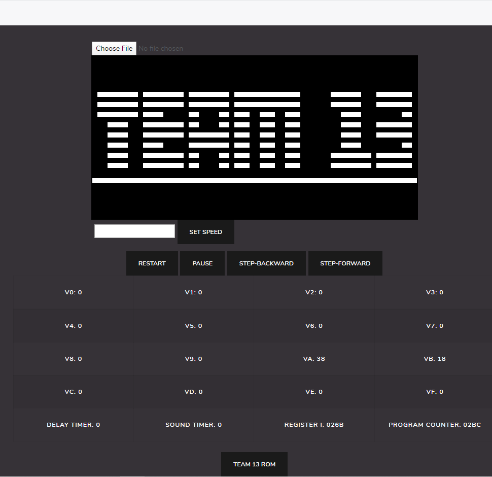
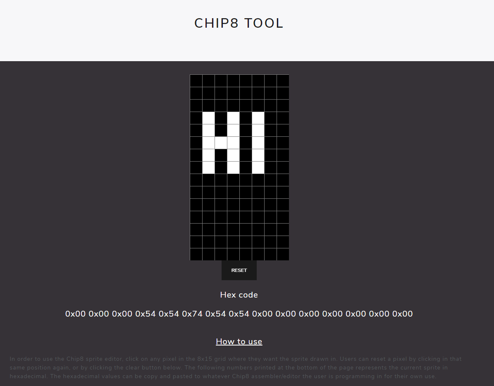
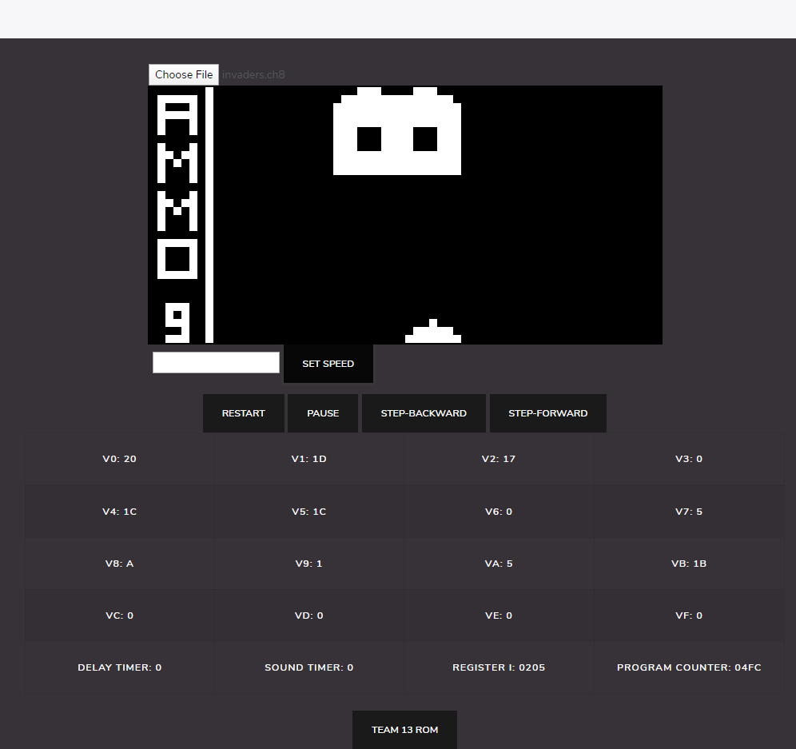
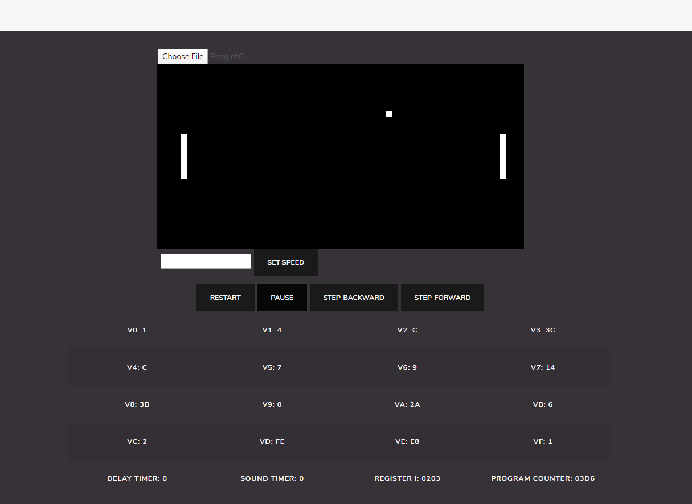

# CMPT276 TEAM 13 

Chip8 is an interpreted low-level programming language which runs programs like video games on 8-bit computers used heavily in the 1970’s. 

Our team was tasked to create a Chip8 emulator and visualizer that can run and display Chip8 programs on any modern web browser using Javascript.

Main website: emulator/index.html

Demo:

